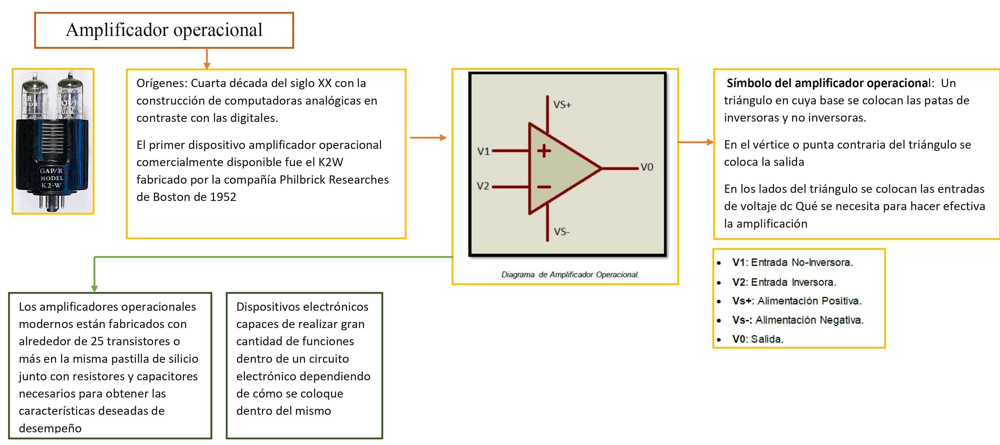
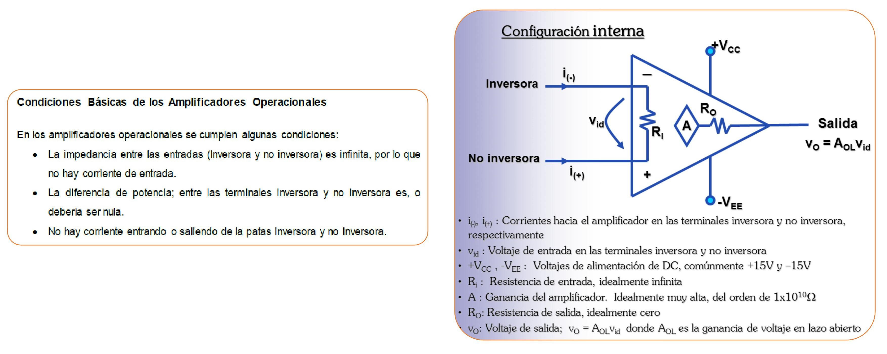
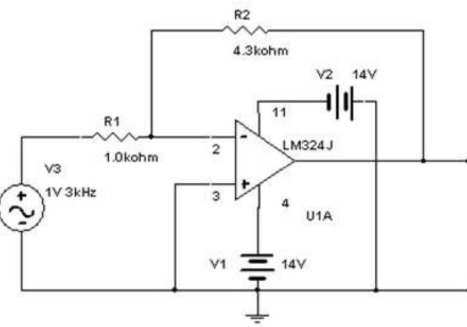
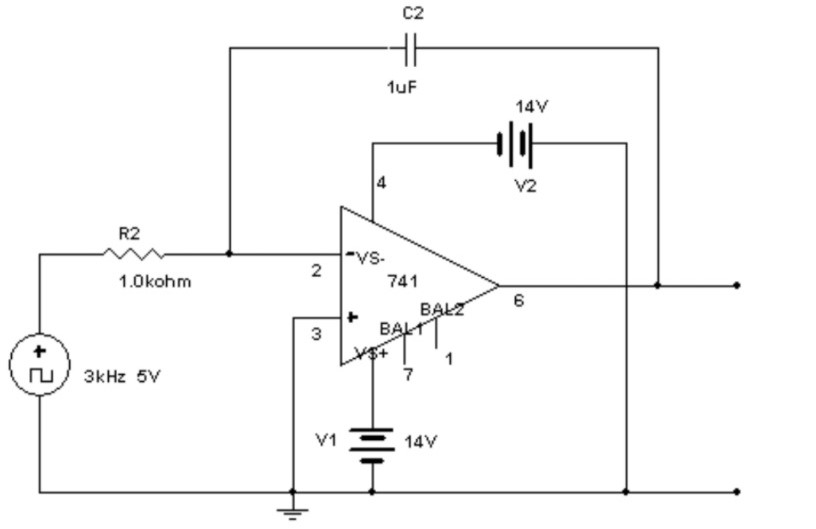
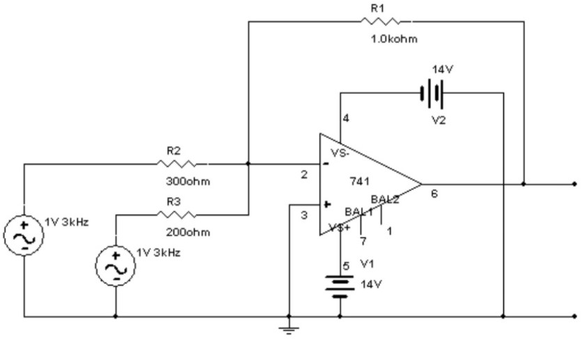
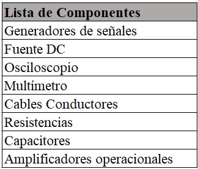

# Informe 9

Práctica de Laboratorio 9

1.OBJETIVOS

_Objetivo General_

• Estudiar el comportamiento de los amplificadores operacionales, y observar el resultado en tres configuraciones de elementos diferente. Hacer uso de la ganancia en lazo cerrado y ver como la variacion de los componentes y la frecuencia con la realimentación,  depende de los elementos empleados en el circuito.

_Objetivos Específicos_

• Verificar el principio de funcionamiento de un amplificador operacional.

• Explicar el funcionamiento teórico de un amplificador

• Detallar las formulas de ganancia de señal de un amplificador alimentado.
  
• Enumerar los usos más frecuentes de los amplificadores operacionales.
 
• Construir tres circuitos utilizando un amplificador operacional, y demostrar su funcionamiento mediante el osciloscopio.

2.MARCO TEÓRICO:

Un amplificador operacional consta de una entrada diferencial proporcionanso una ganancia extremadamente alta, cuyas características de operación estan determinadas por los elementos de realimentación utilizados. El proceso, la técnica, y el método con que se incluya un amplificador operacional en un circuito, es siempre crucial para determinar la forma en que funcionará.

3.DIAGRAMAS

_Diagrama 1:_

_Diagrama 2:_

_Diagrama 3:_

4.LISTA DE COMPONENTES

5.EXPLICACIÓN 

•	Preguntas

_1.- Anote parámetros técnicos importantes de un amplificador operacional que deben ser tomados en cuenta al momento de utilizarlos en un proyecto._

Tensión de alimentación (V+ y V-)

Es la tensión de alimentación máxima permitida que puede aplicarse con seguridad al amplificador. Aunque se designa como estándar 15 V de alimentación, la mayoría de los AO integrados operan sobre un amplio rango de potenciales, algunos van desde valores tan bajos como 1 V, y otros hasta 40 V.

Rango de Temperatura de operación (Tor)

Es el rango de temperatura dentro del cual el dispositivo funcionar con las especificaciones mostradas.

Tensión de entrada diferencial (Vid)

Es la tensión máxima que puede aplicarse con seguridad entre los terminales de entrada diferencial sin flujo excesivo de corriente, estos valores son variables.

Voltaje de entrada en modo común (Vcm)

Es el rango de voltaje que se puede aplicar en ambas entradas respecto a tierra.

Consumo de potencia (Pc)

Es la potencia requerida para operar el AO o la potencia consumida por el AO con propósitos de polarización. Se especifica para 15 Disipación de potencia (PD)Es la potencia que un dispositivo particular es capaz de disipar con seguridad en forma continua mientras opera dentro de un rango de temperatura específico. Esta característica varía de acuerdo al tipo de encapsulado. Por ejemplo, los encapsulados cerámicos permiten una alta disipación de potencia, los metálicos permiten la siguiente más alta disipación, en cambio los de plásticos tienen la más baja. Un valor típico es de 500 mW

_2.- Investigue las características de amplificadores operacionales distintos a los utilizados en esta práctica._

Amplificador Operacional No Inversor 

Este circuito es muy parecido al inversor, la diferencia es que la señal se introduce por el terminal no inversor, lo cual va a significar que la señal de salida estará en fase con la señal de entrada y amplificada. El análisis matemático será igual que en el montaje inversor.  la ganancia de éste amplificador no puede ser menor que 1. la corriente de entrada al operacional es cero, por lo tanto, I1 es igual a I2.

Amplificador Operacional Diferencial 

Este dispositivo nos permite obtener la derivada de la señal de entrada. En el caso general la tensión de entrada variará con el tiempo Vi= Vi(t). La principal diferencia que se observa en este circuito es la presencia de un condensador de capacidad constante C. Como se sabe la carga Q que almacena un condensador es proporcional a su capacidad C y a la diferencia de potencial V a la que estén sometidos las armaduras de éste (Q=CV). Es fácil entender que si la tensión varía con el tiempo y la capacidad del condensador es constante, la carga que éste almacena también variará con el tiempo, Q= Q(t).

Amplificador Sumador No inversor

Tiene múltiples entradas en el pin no inversor. Al igual que en un sumador inversor cada entrada tiene su propia impedancia de entrada que esta por el orden de 100 Mega Ohmios o más y solo hay una impedancia de salida que esta por el orden de mili Ohmios o menos.

Amplificador Operacional Seguidor de Voltaje

 Este amplificador hace que la salida siga a la entrada, es decir el voltaje de salida es el mismo voltaje de entrada. Al presentar una alta impedancia de entrada (por el orden de Megas de Ohm o más), se garantiza una baja potencia de entrada, que a su vez garantiza que la señal de entrada no se distorsionara al conectarse al pin no inversor, y además que la señal de entrada quedara en su totalidad en la impedancia de entrada. Al presentar una muy baja impedancia de salida se garantiza que haya una transferencia total de potencia a la RL de salida.

_3.- Investigue otras aplicaciones con circuitos más complejos que utilizan amplificadores operacionales._

Amplificador de instrumentación

El amplificador de instrumentación es un amplificador diferencial tensión-tensión cuya ganancia puede establecerse de forma muy precisa y que ha sido optimizado para que opere de acuerdo a su propia especificación aún en un entorno hostil. Es un elemento esencial de los sistemas de medida, en los que se ensambla como un bloque funcional que ofrece características funcionales propias e independientes de los restantes elementos con los que interacciona .

6.CONCLUSIONES:

•	Un amplificador operacional actúa de diferente manera, dependiendo de los elementos a las cuales estén conectados, es decir, si existen elementos resistivos, la amplitud de la onda de salida aumenta, pero si está conectado un capacitor, entonces su amplitud cada vez será menor.

• 

• 

• 
 
7.BIBLIOGRAFÍA

• Floyd Thomas L, “Principios de Circuitos Eléctricos”, 8 ed. 2007 .Pearson Educación de México, S.A. de C.V. México, pp. 281-333.

• Agudelo Giraldo, J. D. (2013). Guías de prácca de laboratorio de electrónica y circuitos. 

•adiku. (s.f.). Ampli9cador Operacional. En Sadiku, Fundamentos de Circuitos Eléctricos.
